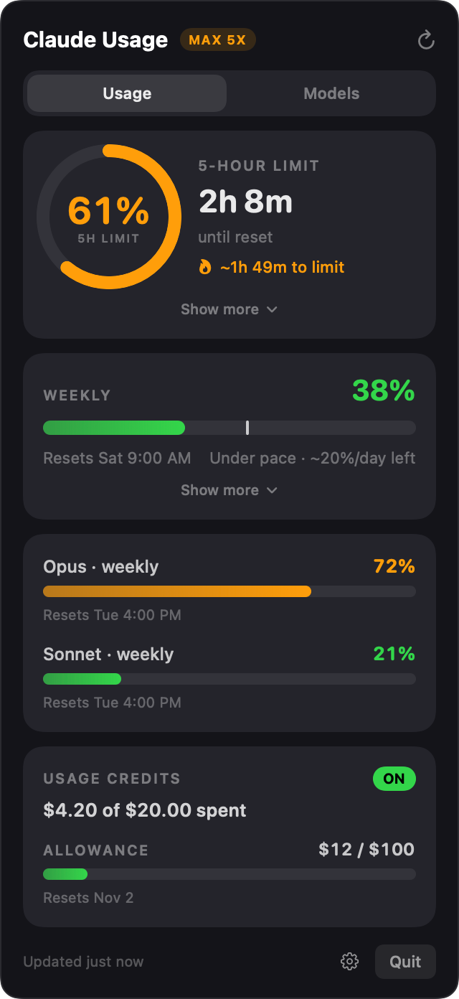
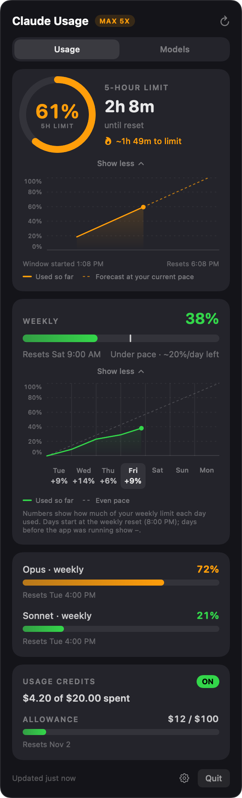
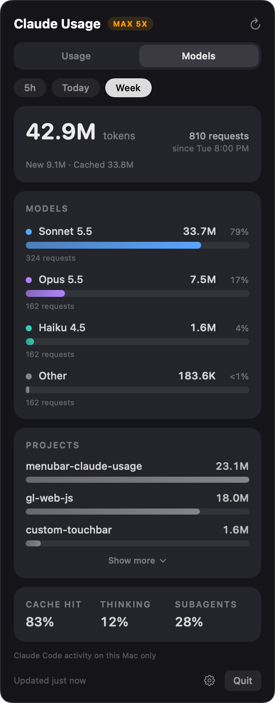
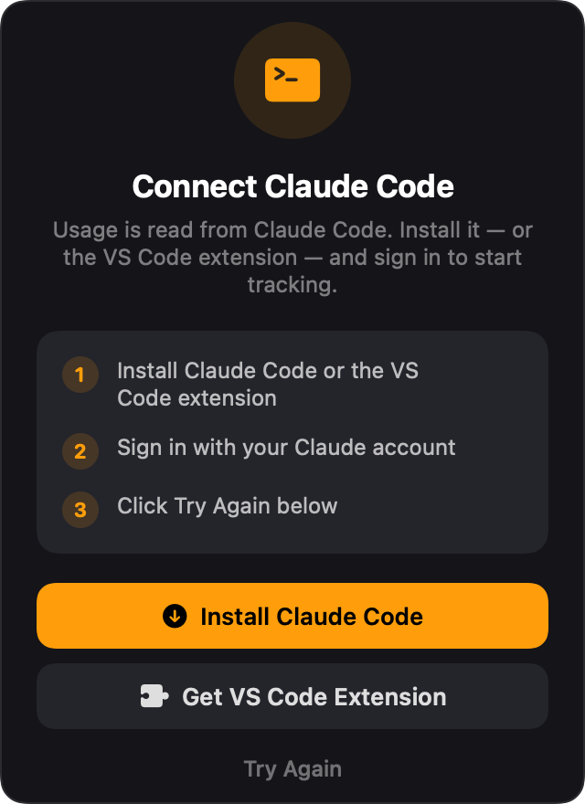
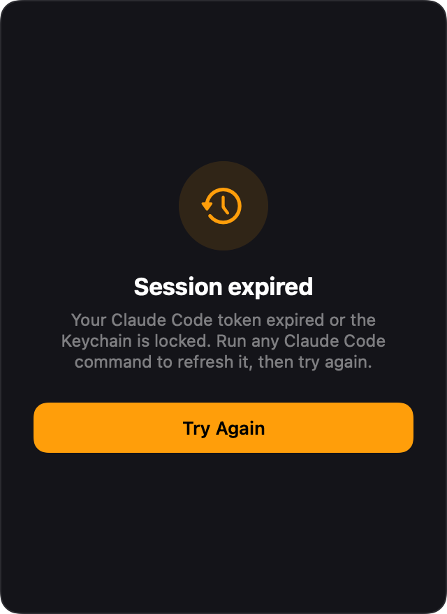

<p align="center">
  
</p>

<h1 align="center">Claude Usage</h1>

<p align="center">
  A lightweight macOS menu bar app that shows your Claude Pro/Max usage in real time.
</p>

<p align="center">
  
  
  
  
</p>

---

## Overview

**Claude Usage** lives in your menu bar and keeps you informed about your Claude usage limits at a glance — no browser tabs, no digging through settings.

```
🟠 61% · 2h 8m
```

The menu bar title is color-coded and always reflects the real state:

| State | Menu bar |
|-------|----------|
| Active 5-hour limit | `🟢 / 🟠 / 🔴  61% · 2h 8m` |
| Weekly mode | `🟢 / 🟠 / 🔴  38% wk · 3d` |
| No active 5-hour limit | `○ No 5h limit` |
| Loading / no data yet | `◌ …` |
| Token expired | `⚠ Expired` |
| Not signed in | `○ Sign in` |

Click the icon to open the detail popover. Choose what the menu bar shows — 5-hour limit, weekly, or whichever is higher — from the gear menu.

---

## Screens

<table>
<tr>
<td align="center" width="33%">
<br>
<b>Usage</b><br>
<sub>5-hour limit, weekly, per-model limits & credits</sub>
</td>
<td align="center" width="33%">
<br>
<b>Trends</b><br>
<sub>Show more: pace chart, forecast, and per-day weekly usage</sub>
</td>
<td align="center" width="33%">
<br>
<b>Models</b><br>
<sub>Tokens per model and project, from local Claude Code history</sub>
</td>
</tr>
<tr>
<td align="center" width="33%">
<br>
<b>Connect Claude Code</b><br>
<sub>Shown when no credentials are found</sub>
</td>
<td align="center" width="33%">
<br>
<b>Session expired</b><br>
<sub>Token expired or Keychain locked</sub>
</td>
<td></td>
</tr>
</table>

<sub>Screenshots use sample data.</sub>

The main popover shows:

- **5-hour limit** — ring gauge, live countdown, and a projection of when you'll hit the limit (or that it lasts past reset). **Show more** opens a chart of the current window with a 0–100% axis, your usage so far, and a dashed forecast at your current pace
- **Weekly usage** — 7-day window with reset day/time, a pace marker, and the % per day you have left. **Show more** adds a weekly chart and a per-day row showing how much of the weekly limit each day used (days start at your weekly reset time)
- **Per-model limits** — Opus, Sonnet and other limits appear automatically when your plan reports them
- **Plan badge** — Pro / Max 5x / Max 20x
- **Usage credits & allowance** — ON/OFF, spend, and any dollar allowance
- **Models tab** — tokens per model, top projects, and cache / thinking / subagent shares for the 5-hour window, today, or the week, read from your local Claude Code transcripts (this Mac only)
- **Gear menu** — Launch at Login and the menu bar display mode
- One-click **Refresh** and **Quit**

When the token expires it no longer pretends you're signed out — it shows a clear **Session expired** screen and refreshes automatically the next time you use Claude Code.

---

## Features

- **Real-time data** — polls the Anthropic usage endpoint every 2 minutes, with a 60-second local countdown in between
- **Rate-limit aware** — opening the popover never fetches more than once per 45 seconds, and a `429` makes the app wait as long as the server asks (`Retry-After`, or 2 minutes doubling up to 15) while your last numbers stay on screen
- **Per-model usage** — transcripts in `~/.claude/projects` are indexed incrementally in the background (only new data is read after the first run), with small totals cached in `~/Library/Application Support/ClaudeUsageBar/`
- **Pace projection** — a short usage history is kept locally (7 days, in `~/Library/Application Support/ClaudeUsageBar/`) to estimate your burn rate
- **Multiple accounts** — usage history and the cached response are kept per Claude account (identified through the account id, no password involved), so switching accounts never mixes their charts; the account name appears in the header once a second account is seen
- **Offline-friendly** — the last good response is cached, so a rate-limited or offline launch shows recent numbers with their age
- **Color-coded indicators** — 🟢 0–60% · 🟠 61–85% · 🔴 86–100%
- **Accurate auth states** — tells "not signed in", "expired/locked", and "active" apart instead of showing a misleading sign-in screen
- **Flexible credential lookup** — honors `CLAUDE_CONFIG_DIR`, the default `~/.claude`, and the macOS Keychain
- **Zero dependencies** — pure Swift + SwiftUI/AppKit, no Node, no Electron
- **Tiny footprint** — menu-bar only, no Dock icon
- **Launch at Login** — via `SMAppService`

---

## Requirements

- macOS 13 Ventura or later
- [Claude Code](https://claude.com/claude-code) **or** the [Claude Code VS Code extension](https://marketplace.visualstudio.com/items?itemName=anthropic.claude-code), installed and signed in

> The app reads your existing Claude Code OAuth token — there is no separate login.

---

## Installation

### Option A — DMG (recommended)

1. Download the latest `ClaudeUsageBar-x.x.x.dmg` from [Releases](../../releases)
2. Open the DMG and drag **ClaudeUsageBar** onto **Applications**
3. Launch it from Applications

<p align="center">
  
</p>

> On first launch, macOS may ask to allow access to the *Claude Code-credentials* Keychain item — click **Always Allow**.

### Option B — Build from source

```bash
git clone https://github.com/rtoedz/menubar-claude-usage.git
cd menubar-claude-usage
./make_app.sh
cp -R ClaudeUsageBar.app ~/Applications/
open ~/Applications/ClaudeUsageBar.app
```

> **Tip:** Install to `~/Applications/` (not just run from the project folder) so Launch at Login persists.

---

## How it works

Claude Usage reads your OAuth token from the same places Claude Code stores it, in order:

1. `$CLAUDE_CONFIG_DIR/.credentials.json` (if the variable is set)
2. `~/.claude/.credentials.json`
3. macOS Keychain — service `Claude Code-credentials`

It then calls `https://api.anthropic.com/api/oauth/usage` directly with `URLSession` — no subprocess, no extra runtime. A second call to `/api/oauth/profile` identifies the account (only at launch and when the login token changes) so history can be kept per account. These are the only network requests the app makes.

If the token can't be read or the API returns `401`, the app distinguishes a genuine sign-out (no credentials anywhere) from an expired/locked token (credentials present), and shows the matching screen.

### What is stored locally

The API only reports the current percentage — it has no history. The charts, pace forecast and per-day numbers are built from points the app records itself, so they start when the app first runs and have gaps while it is closed.

Everything lives in `~/Library/Application Support/ClaudeUsageBar/`:

| File | Contents |
|------|----------|
| `history-<account>.json` | Up to 7 days of 5-hour / weekly percentage samples, per account |
| `last-usage-<account>.json` | The last good API response, shown immediately at launch |
| `model-index.json` | Per-5-minute token totals from Claude Code transcripts, for the Models tab |

The Models tab reads `~/.claude/projects/**/*.jsonl` (Claude Code on this Mac only — not claude.ai or other machines). Files untouched for 10 days are skipped, and only newly appended lines are read after the first run. Transcripts don't record which account wrote them, so the tab combines all accounts on the Mac. Token counts are not a share of your plan limit — the API doesn't report per-model percentages on every plan.

---

## Build & distribute

```bash
# Dev run (no bundle features like Launch at Login)
swift run

# Build the release .app bundle
./make_app.sh

# Package a distributable DMG installer
./make_dmg.sh
```

The DMG background (title, arrow, Applications icon) is generated by `scripts/generate_dmg_background.swift` and embedded automatically by `make_dmg.sh`.

---

## Project structure

```
Sources/ClaudeUsageBar/
├── main.swift          Entry point
├── AppDelegate.swift   NSStatusItem + popover panel wiring
├── UsageManager.swift  API fetch, polling, accounts, display model, login item
├── UsageHistory.swift  Sample history store + burn-rate projection
├── ModelIndex.swift    Incremental Claude Code transcript indexer (Models tab)
└── PopoverView.swift   SwiftUI popover, charts, Models tab, setup/expired screens
Resources/
├── AppIcon.icns        App icon (all sizes)
└── dmg-background.png   DMG installer window background
scripts/
├── generate_icon.swift            Regenerates AppIcon.icns
└── generate_dmg_background.swift   Regenerates the DMG background
assets/                 README screenshots
Info.plist              Bundle config (LSUIElement, bundle ID)
make_app.sh             Builds the release .app bundle
make_dmg.sh             Packages the app into a DMG installer
```

---

## Debug flags

| Variable | Effect |
|----------|--------|
| `CUB_DEBUG_POPOVER=1` | Renders the popover in a standalone window for screenshots |
| `CUB_TEST_LOGIN=1` / `=0` | Enables / disables the Launch-at-Login item on launch |
| `CUB_MOCK=1` | Sample data and history, no network, nothing written to disk |
| `CUB_MOCK_STATE=missing` / `expired` | With `CUB_MOCK`, shows the sign-in / expired screens |
| `CUB_MOCK_ACCOUNTS=1` | With `CUB_MOCK`, shows the multi-account header |
| `CUB_RENDER=/path/out.png` | Renders the popover to a PNG and quits (used for the README screenshots) |

---

## Notifications

Usage-threshold notification code (alerts at 80% / 95%) is included but **disabled**: macOS suppresses `UserNotifications` for ad-hoc-signed apps. To enable banners, sign the bundle with a Developer ID certificate and re-enable the two call sites noted in `UsageManager.swift`.

---

## Contributing

Contributions are welcome — open an issue or a pull request.

1. Fork the repo
2. Create a feature branch (`git checkout -b feat/my-feature`)
3. Commit your changes
4. Open a Pull Request

---

## License

MIT — see [LICENSE](LICENSE) for details.
